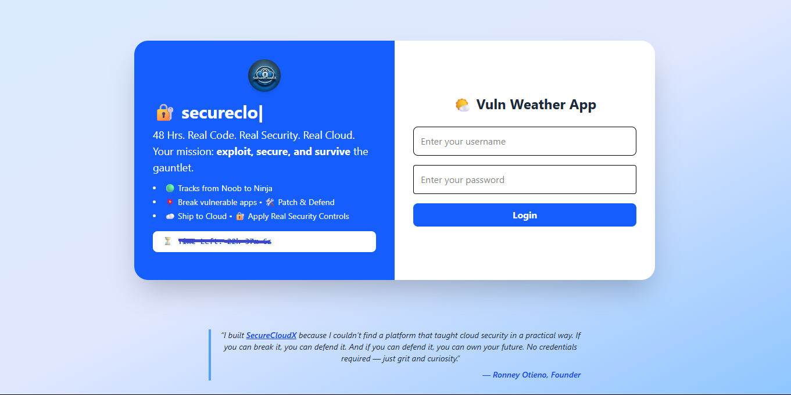

# vuln-weather-app

A simple vulnerable by design weather application built for the **SecureCloudX Hackathon**.

## 🚀 New Here? START HERE!

**👉 Read: [START-HERE.md](START-HERE.md) 👈**

Choose your path:

- **🎯 Participant**: Want to solve the security challenge? → [PARTICIPANT-QUICK-START.md](PARTICIPANT-QUICK-START.md)
- **📋 Organizer**: Want to run an event? → [ORGANIZER-QUICK-START.md](ORGANIZER-QUICK-START.md)

## About the App

- Fetches current weather data for any city
- Simple and intuitive user interface
- Built with React and Vite
- **Deliberately vulnerable** for educational purposes



## Getting Started (Technical Details)

### Local Development

1. Clone the repository:

   ```bash
   git clone https://github.com/your-username/vuln-weather-app.git
   cd vuln-weather-app
   ```

2. Install dependencies:

   ```bash
   npm install
   ```

3. Start the development server:

   ```bash
   npm run dev
   ```

## Docker

This application can be run using Docker for easy deployment and development.

### Prerequisites

- Docker installed on your system
- Docker Compose (optional, for easier management)

### Quick Start with Docker

1. **Build the Docker image:**

   ```bash
   docker build -t vuln-weather-app .
   ```

2. **Run the container:**

   ```bash
   docker run -p 5173:5173 vuln-weather-app
   ```

   The app will be available at `http://localhost:5173`

### Docker Compose (Recommended)

If you prefer using Docker Compose, create a `docker-compose.yml` file:

```yaml
version: "3.8"
services:
  weather-app:
    build: .
    ports:
      - "5173:5173"
    environment:
      - NODE_ENV=development
    volumes:
      - .:/app
      - /app/node_modules
```

Then run:

```bash
docker compose up
```

### Development with Docker

For development with hot reload, you can mount the source code as a volume:

```bash
docker run -p 5173:5173 -v $(pwd):/app -v /app/node_modules vuln-weather-app
```

### Useful Docker Commands

- **Stop running container**: `docker stop <container-id>`
- **View running containers**: `docker ps`
- **View container logs**: `docker logs <container-id>`
- **Remove container**: `docker rm <container-id>`
- **Remove image**: `docker rmi vuln-weather-app`
- **Clean up unused containers/images**: `docker system prune`

### Docker Compose Commands

- **Start services**: `docker-compose up`
- **Start in background**: `docker-compose up -d`
- **Stop services**: `docker-compose down`
- **View logs**: `docker-compose logs -f`
- **Rebuild and start**: `docker-compose up --build`

## License

This project is licensed for hackathon use only.
